# BAMBI Wildlife Orientation Estimation

---

# Project Summary

---

## 1. Project Objective

The objective of this project is to develop a preprocessing pipeline for animal orientation estimation using thermal drone imagery from the BAMBI wildlife dataset.

The original BAMBI dataset provides object detection annotations in YOLO format. However, predicting animal orientation requires additional geometric information describing the position of the head and tail.

Therefore, the project consists of two major stages:

1. Dataset exploration and validation
2. Generation of keypoint annotations suitable for orientation estimation

The final output is a YOLO-compatible keypoint dataset that can be used to train head-tail detection and orientation estimation models.

---

## 2. Processing Pipeline

```text
BAMBI Dataset
      │
      ▼
Data Exploration
      │
      ▼
Dataset Validation
      │
      ▼
Ground Truth Annotation Import
      │
      ▼
Head/Tail Pair Extraction
      │
      ▼
Quality Validation
      │
      ▼
YOLO Keypoint Dataset
      │
      ▼
Model Training
(Approach A: Keypoint Regression  |  Approach B: Angle Regression)
      │
      ▼
Evaluation
      │
      ▼
Visualization
```

---

# Notebook 01 – Data Exploration

## Objective

The purpose of this notebook is to understand the structure and quality of the BAMBI dataset before generating orientation labels.

The notebook investigates:

* Dataset statistics
* Annotation completeness
* Class distribution
* Bounding box properties
* Annotation quality

---

## Dataset Statistics

### Motivation

Before developing machine learning models, it is necessary to verify that the dataset is complete and that all splits contain the expected number of images and annotations.

### Implementation

```python
stats = get_data_stats(str(DATA_DIR))

for split in ['train', 'val', 'test']:
    print(f"\n{split.upper()}:")
    print(f" Images: {stats[split].get('num_images', 0)}")
    print(f" Labels: {stats[split].get('num_labels', 0)}")
    print(f" Objects: {stats[split].get('total_objects', 0)}")
```

### Explanation

The custom utility function:

```python
get_data_stats()
```

scans the dataset folders and collects:

* Number of image files
* Number of label files
* Total number of annotated animals

The loop then prints the statistics for each split separately.

### Why This Step Is Important

This serves as a dataset integrity check and helps identify:

* Missing label files
* Corrupted annotations
* Incomplete dataset splits

before any downstream processing is performed.

---

## Bounding Box Analysis

### Motivation

The complexity of orientation estimation depends heavily on how many animals appear in each image.

### Implementation

```python
box_counts = []

for label_file in TRAIN_LABELS.glob('*.txt'):
    with open(label_file) as f:
        lines = [l.strip() for l in f if l.strip()]

    box_counts.append(len(lines))
```

### Explanation

Each YOLO annotation file contains one line per object.

For example:

```text
0 0.45 0.32 0.12 0.09
0 0.70 0.60 0.15 0.11
```

contains two objects.

The code therefore uses:

```python
len(lines)
```

to determine how many animals are present in the image.

### Findings

The resulting distribution reveals:

* Average objects per image
* Maximum scene density
* Frequency of multi-animal scenes

These statistics are important because crowded scenes increase the difficulty of orientation estimation.

---

## Visual Annotation Verification

### Motivation

Numerical statistics alone cannot guarantee annotation quality.

Therefore, random samples are visualized.

### Implementation

```python
img = Image.open(img_path)

labels = load_yolo_labels(label_path)

for label in labels:
    x, y, w, h = ...
    rect = plt.Rectangle(...)
    ax.add_patch(rect)
```

### Explanation

The notebook:

1. Loads a thermal image.
2. Loads the corresponding YOLO annotations.
3. Converts normalized coordinates into pixel coordinates.
4. Draws the bounding boxes.

### Result

This provides a direct visual confirmation that:

* Annotations align correctly
* Objects are not truncated
* Labels correspond to visible animals

---

## Class Distribution Analysis

### Motivation

Class imbalance can significantly affect object detection performance.

### Implementation

```python
counts = stats[split]['class_counts']

plt.bar(
    counts.keys(),
    counts.values()
)
```

### Explanation

The notebook extracts class frequencies from each dataset split and visualizes them using bar charts.

### Purpose

This analysis helps identify:

* Dominant species
* Underrepresented species
* Potential augmentation requirements
* Dataset bias

---

## Bounding Box Size Analysis

### Motivation

Animal orientation estimation becomes more difficult when objects occupy only a small number of pixels.

### Implementation

```python
widths = []
heights = []

for bbox in all_boxes:
    widths.append(bbox['width'])
    heights.append(bbox['height'])
```

### Explanation

The width and height of every annotated object are collected and visualized using histograms.

### Purpose

This reveals:

* Typical animal size
* Scale variation
* Small-object detection challenges

---

# Notebook 02 – Data Preparation

## Objective

The original BAMBI annotations contain only bounding boxes.

To estimate orientation, the dataset must be enriched with head and tail keypoints.

This notebook converts manually annotated keypoints into YOLO keypoint labels.

---

## Loading Ground Truth Annotations

### Motivation

Annotations were exported from Label Studio in multiple JSON files.

All exports must be merged into a single source of truth.

### Implementation

```python
def load_json_safe(path):
    """Load JSON with helpful error messages."""
    path = Path(path)
    if not path.exists():
        print(f"  SKIP: {path.name} not found")
        return []
    if path.stat().st_size == 0:
        print(f"  SKIP: {path.name} is empty (0 bytes)")
        return []
    try:
        with open(path, encoding='utf-8') as f:
            data = json.load(f)
        print(f"  OK: {path.name} → {len(data)} annotations")
        return data
    except json.JSONDecodeError as e:
        print(f"  ERROR: {path.name} is not valid JSON: {e}")
        return []
```

### Explanation

This helper function ensures robust loading by handling:

* Missing files
* Empty files
* Malformed JSON

without interrupting execution.

---

## Merging Annotation Exports

### Implementation

```python
def merge_ground_truth_files():
    print("Loading GT files...\n")
    all_data = []
    for path in [GT_EXPORT_OLD, GT_EXPORT_NEW_train, GT_EXPORT_NEW_val, GT_EXPORT_NEW_test]:
        all_data += load_json_safe(path)
    
    print(f"\nTotal GT annotations: {len(all_data)}")
    
    if len(all_data) == 0:
        print("ERROR: No annotations loaded. Check your file paths and contents.")
        return None
    
    merged_path = DATA_DIR / 'ground_truth' / 'labels' / 'all_annotations_merged.json'
    merged_path.parent.mkdir(parents=True, exist_ok=True)
    with open(merged_path, 'w') as f:
        json.dump(all_data, f, indent=2)
    print(f"Saved merged file: {merged_path}")
    return merged_path

GT_EXPORT = merge_ground_truth_files()
```

### Explanation

Multiple annotation batches are concatenated into a single dataset.

The resulting merged file becomes the master annotation source used throughout the notebooks.

---

## Head-Tail Extraction

### Motivation

Label Studio stores head and tail points as individual annotations.

These must be grouped into pairs representing a single animal.

### Implementation

```python
## Process Ground Truth with Keypoint Pairing

def parse_keypoint_pairs(results):
    """
    Pair Head/Tail keypoints by the order they were annotated.
    The annotator labeled them consecutively: Head, Tail, Head, Tail...
    so we pair them in the order they appear in the results list,
    matching each Head with the next Tail that follows it.
    Falls back to nearest-neighbour only if ordering is ambiguous.
    """
    # Separate into heads and tails, preserving annotation order
    heads = []
    tails = []
    
    for r in results:
        label = r['value']['keypointlabels'][0]
        x = r['value']['x'] / 100.0
        y = r['value']['y'] / 100.0
        pos = (x, y)
        if label == 'Head':
            heads.append(pos)
        elif label == 'Tail':
            tails.append(pos)

    if not heads or not tails:
        return []

    # Check if annotation was done in strict alternating order
    # by rebuilding the interleaved sequence
    pairs = []
    pending_head = None

    for r in results:
        label = r['value']['keypointlabels'][0]
        x = r['value']['x'] / 100.0
        y = r['value']['y'] / 100.0

        if label == 'Head':
            if pending_head is not None:
                # Two heads in a row — nearest-neighbour fallback for this head
                # (find closest tail not yet used)
                pass
            pending_head = (x, y)
        elif label == 'Tail':
            if pending_head is not None:
                pairs.append({'head': pending_head, 'tail': (x, y)})
                pending_head = None
            # Tail without preceding head — skip

    # If some heads had no following tail, pair remaining by nearest-neighbour
    if pending_head is not None:
        used_tails = {p['tail'] for p in pairs}
        remaining_tails = [t for t in tails if t not in used_tails]
        if remaining_tails:
            best_tail = min(remaining_tails,
                            key=lambda t: (pending_head[0]-t[0])**2 + (pending_head[1]-t[1])**2)
            pairs.append({'head': pending_head, 'tail': best_tail})

    return pairs


def match_pairs_to_bboxes(pairs, bbox_lines):
    results = []
    used_lines = set()

    for pair in pairs:
        mid_x = (pair['head'][0] + pair['tail'][0]) / 2
        mid_y = (pair['head'][1] + pair['tail'][1]) / 2

        best_dist, best_idx, best_line = float('inf'), None, None
        for i, line in enumerate(bbox_lines):
            if i in used_lines:
                continue
            parts = line.strip().split()
            if len(parts) < 5:
                continue
            cx, cy = float(parts[1]), float(parts[2])
            bw, bh = float(parts[3]), float(parts[4])

            # Only match if midpoint falls within 2x the bbox area
            if abs(mid_x - cx) > bw and abs(mid_y - cy) > bh:
                continue

            d = np.sqrt((mid_x - cx)**2 + (mid_y - cy)**2)
            if d < best_dist:
                best_dist, best_idx, best_line = d, i, line.strip()

        if best_line:
            results.append({
                'bbox_line': best_line,
                'head': pair['head'],
                'tail': pair['tail']
            })
            used_lines.add(best_idx)

    return results


def process_real_ground_truth_with_split():
    if GT_EXPORT is None or not GT_EXPORT.exists():
        print("ERROR: No merged GT file found. Run merge step first.")
        return 0, 0, 0

    with open(GT_EXPORT) as f:
        data = json.load(f)
    print(f"Loaded {len(data)} total GT annotations\n")

    valid_items = []
    skipped = 0

    for item in data:
        file_upload = item.get('data', {}).get('img', '')

        if not file_upload:
            print(f"  SKIP item id={item.get('id')} - no image path")
            continue

        raw_stem = Path(file_upload).stem

        # Remove LS upload prefix/hash
        # Example:
        #   "141d1290-6_4645" -> "6_4645"
        if '-' in raw_stem:
            img_name = raw_stem.split('-', 1)[-1]
        else:
            img_name = raw_stem

        if not img_name:
            print(f"  SKIP bad filename: {file_upload}")
            continue

        for ann in item.get('annotations', []):
            pairs = parse_keypoint_pairs(ann.get('result', []))
            if not pairs:
                print(f"  SKIP {img_name}: no valid head/tail pairs")
                skipped += 1
                continue
            for pair in pairs:
                valid_items.append({
                    'img_name': img_name,
                    'head': pair['head'],
                    'tail': pair['tail']
                })

    print(f"Valid (img, head, tail) entries: {len(valid_items)}  |  Skipped: {skipped}\n")

    # Shuffle and split 70/15/15
    import random
    random.shuffle(valid_items)
    n = len(valid_items)
    t = int(n * 0.70)
    v = int(n * 0.15)
    splits_data = {
        'train': valid_items[:t],
        'val':   valid_items[t:t+v],
        'test':  valid_items[t+v:]
    }
    for s, items in splits_data.items():
        print(f"  {s:5}: {len(items)} entries")

    counts = {'train': 0, 'val': 0, 'test': 0}

    for split, items in splits_data.items():
        for item in items:
            img_name = item['img_name']
            head     = item['head']
            tail     = item['tail']

            # Search for the label file across all original splits
            orig_label_path = None
            for src_split in ['train', 'val', 'test']:
                candidate = DATA_DIR / 'labels' / src_split / f"{img_name}.txt"
                if candidate.exists():
                    orig_label_path = candidate
                    break

            if orig_label_path is None:
                print(f"  WARN: no label file found for {img_name}")
                continue

            with open(orig_label_path) as f:
                bbox_lines = f.readlines()

            matched = match_pairs_to_bboxes([{'head': head, 'tail': tail}], bbox_lines)

            if not matched:
                print(f"  WARN: could not match keypoints to bbox for {img_name}")
                continue

            output_path = OUTPUT_DIR / 'labels_keypoints' / split / f"{img_name}.txt"
            output_path.parent.mkdir(parents=True, exist_ok=True)

            # Append mode so multiple animals in same image accumulate
            with open(output_path, 'a') as f:
                for m in matched:
                    h, t_ = m['head'], m['tail']
                    f.write(
                        f"{m['bbox_line']} "
                        f"{h[0]:.6f} {h[1]:.6f} 1 "
                        f"{t_[0]:.6f} {t_[1]:.6f} 1\n"
                    )
            counts[split] += 1

    print(f"\nCreated keypoint labels:")
    for s, c in counts.items():
        print(f"  {s:5}: {c}")

    return counts['train'], counts['val'], counts['test']


train_count, val_count, test_count = process_real_ground_truth_with_split()
```

### Explanation

Each annotation is inspected and classified as:

* Head
* Tail

Coordinates are converted from percentages into normalized coordinates ranging from 0 to 1.

Example:

```json
{
  "x": 52.4,
  "y": 31.7
}
```

becomes:

```python
(0.524, 0.317)
```

---

## Keypoint Pairing Strategy

### Motivation

Head and tail annotations must be matched correctly.

### Approach

The annotation workflow followed the sequence:

```text
Head → Tail → Head → Tail
```

Therefore the notebook pairs points using annotation order.

### Validation

Distances between head and tail points are computed:

```python
# check if old files exist and when they were last modified
import os
label_dir = OUTPUT_DIR / 'labels_keypoints' / 'train'
if label_dir.exists():
    files = list(label_dir.glob('*.txt'))
    if files:
        newest = max(files, key=lambda f: f.stat().st_mtime)
        oldest = min(files, key=lambda f: f.stat().st_mtime)
        import datetime
        print(f"Files found: {len(files)}")
        print(f"Newest: {newest.name} modified {datetime.datetime.fromtimestamp(newest.stat().st_mtime)}")
        print(f"Oldest: {oldest.name} modified {datetime.datetime.fromtimestamp(oldest.stat().st_mtime)}")
        print(f"\nSample content of newest file:")
        with open(newest) as f:
            for line in f:
                parts = line.strip().split()
                if len(parts) >= 11:
                    head = np.array([float(parts[5]), float(parts[6])])
                    tail = np.array([float(parts[8]), float(parts[9])])
                    print(f"  dist={np.linalg.norm(head-tail):.4f}  {line.strip()}")
else:
    print("Label directory does not exist")
```
**Output:**
~~~text
Files found: 123
Newest: 145_898.txt modified 2026-05-30 18:00:04.188862
Oldest: 1_10779.txt modified 2026-05-30 17:59:52.594271

Sample content of newest file:
  dist=0.0183  53 0.580078125 0.50146484375 0.0341796875 0.0263671875 0.583747 0.506351 1 0.567467 0.498051 1
~~~

### Purpose

Distance analysis helps identify:

* Incorrect pairings
* Duplicated annotations
* Labeling mistakes

Very small or extremely large distances are flagged.

---

## Annotation Quality Control

### Implementation

```python
# check distances in the new keypoint labels to see if they look reasonable (not collapsed to same point)
distances = []
for label_file in (OUTPUT_DIR / 'labels_keypoints' / 'train').glob('*.txt'):
    with open(label_file) as f:
        for line in f:
            parts = line.strip().split()
            if len(parts) >= 11:
                head = np.array([float(parts[5]), float(parts[6])])
                tail = np.array([float(parts[8]), float(parts[9])])
                distances.append(np.linalg.norm(head - tail))

print(f"Total training animals:  {len(distances)}")
print(f"Mean head-tail dist:     {np.mean(distances):.4f}")
print(f"Median head-tail dist:   {np.median(distances):.4f}")
print(f"% with dist < 0.05:      {sum(d < 0.05 for d in distances)/len(distances)*100:.1f}%")
```
~~~txt
Total training animals:  246
Mean head-tail dist:     0.0196
Median head-tail dist:   0.0174
% with dist < 0.05:      98.4%
~~~

### Explanation

The Euclidean distance between paired keypoints is calculated.

Then we compute:

* Mean distance
* Median distance
* Distance distributions

### Purpose

These statistics help identify anomalous annotations that may require additional inspection.

---

## Keypoint Visualization

### Motivation

Numerical validation alone is insufficient, as it does not explain the correct placement of keypoints in full detail.

Visual inspection ensures that generated keypoints are correct.

### Implementation

```python
# Visualize Sample with Keypoints

def visualize_keypoints(img_name, kp_split='test'):
    """Visualize image with keypoints. Searches all image splits for the source image."""
    
    # Find the keypoint label in our output directory
    kp_label = OUTPUT_DIR / 'labels_keypoints' / kp_split / f"{img_name}.txt"
    if not kp_label.exists():
        print(f"Keypoint label not found: {kp_label}")
        return
    
    # Search for the image across all original BAMBI splits
    img_path = None
    for split in ['train', 'val', 'test']:
        candidate = DATA_DIR / 'images' / split / f"{img_name}.jpg"
        if candidate.exists():
            img_path = candidate
            break
    
    if img_path is None:
        print(f"Image not found in any split for: {img_name}")
        print(f"   Searched: {DATA_DIR / 'images' / '*' / (img_name + '.jpg')}")
        return
    
    img = Image.open(img_path)
    width, height = img.size
    
    fig, ax = plt.subplots(1, 1, figsize=(10, 8))
    ax.imshow(img)
    
    handles = {}  # avoid duplicate legend entries
    
    with open(kp_label, 'r') as f:
        for line in f:
            parts = line.strip().split()
            if len(parts) != 11:
                print(f"Skipping malformed row ({len(parts)} values): {line.strip()}")
                continue

            cx     = float(parts[1]) * width
            cy     = float(parts[2]) * height
            w      = float(parts[3]) * width
            h      = float(parts[4]) * height
            head_x = float(parts[5]) * width
            head_y = float(parts[6]) * height
            head_v = int(parts[7])
            tail_x = float(parts[8]) * width
            tail_y = float(parts[9]) * height
            tail_v = int(parts[10])

            rect = plt.Rectangle(
                (cx - w/2, cy - h/2), w, h,
                fill=False, edgecolor='red', linewidth=2
            )
            ax.add_patch(rect)

            if head_v == 1:
                h_pt = ax.plot(head_x, head_y, 'go', markersize=3, zorder=5)[0]
                t_pt = ax.plot(tail_x, tail_y, 'ro', markersize=3, zorder=5)[0]
                ax.annotate('', xy=(head_x, head_y), xytext=(tail_x, tail_y),
                            arrowprops=dict(arrowstyle='->', color='yellow', lw=1,
                                            mutation_scale=5))  # default is 10, lower = smaller arrowhead
                handles['Head'] = h_pt
                handles['Tail'] = t_pt

    if handles:
        ax.legend(handles=list(handles.values()),
                  labels=list(handles.keys()),
                  loc='upper right')

    ax.axis('off')
    ax.set_title(f"Keypoint Annotation: {img_name}  (label split: {kp_split})")
    plt.tight_layout()
    plt.show()


# Show samples from each output split
for kp_split in ['train', 'val', 'test']:
    split_dir = OUTPUT_DIR / 'labels_keypoints' / kp_split
    if not split_dir.exists():
        continue
    files = list(split_dir.glob('*.txt'))
    if not files:
        continue
    img_stem = files[0].stem
    print(f"Visualizing from '{kp_split}' split: {img_stem}")
    visualize_keypoints(img_stem, kp_split)
```
**Output:**
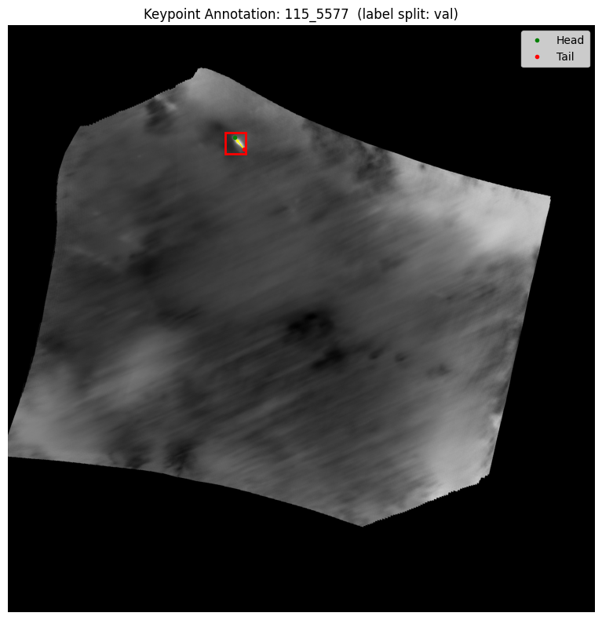

### Explanation

This overlays:

* Bounding boxes
* Head points
* Tail points

on top of the original thermal imagery.

### Purpose

This provides direct visual confirmation that:

* Head and tail assignments are correct
* Keypoints lie inside the animal bounding box
* Pairing logic behaves as expected

---

## Visualization and Inspection of worst labels

### Motivation
Inspection of the largest and smallest distances between head and tail.
This enables us to get a better understanding of the labels.

### Implementation
```python
import matplotlib.pyplot as plt
from PIL import Image

label_distances = []
for split in ['train', 'val', 'test']:
    label_dir = OUTPUT_DIR / 'labels_keypoints' / split
    if not label_dir.exists():
        continue
    for label_file in label_dir.glob('*.txt'):
        with open(label_file) as f:
            for line in f:
                parts = line.strip().split()
                if len(parts) >= 11:
                    head = np.array([float(parts[5]), float(parts[6])])
                    tail = np.array([float(parts[8]), float(parts[9])])
                    dist = np.linalg.norm(head - tail)
                    label_distances.append({
                        'file': label_file,
                        'split': split,
                        'dist': dist,
                        'parts': parts,
                    })

# Sort by distance — look at the ones with largest separation first
label_distances.sort(key=lambda x: x['dist'], reverse=True)

print("Top 10 largest head-tail separations:")
for item in label_distances[:10]:
    print(f"  {item['split']}/{item['file'].stem}: dist={item['dist']:.4f}")

print(f"\nBottom 10 smallest separations:")
for item in label_distances[-10:]:
    print(f"  {item['split']}/{item['file'].stem}: dist={item['dist']:.4f}")
```

**Output:**
```text
Top 10 largest head-tail separations:
  train/229_1009: dist=0.1101
  val/284_9652: dist=0.0879
  train/284_9652: dist=0.0772
  train/229_1317: dist=0.0679
  test/229_1025: dist=0.0551
  train/229_1217: dist=0.0505
  train/229_1317: dist=0.0499
  test/229_1317: dist=0.0465
  train/229_1217: dist=0.0461
  train/146_2173: dist=0.0399

Bottom 10 smallest separations:
  train/115_5867: dist=0.0108
  test/229_1019: dist=0.0104
  train/115_5857: dist=0.0102
  train/229_1277: dist=0.0096
  train/229_1331: dist=0.0091
  train/6_4645: dist=0.0090
  test/229_1317: dist=0.0084
  train/6_4729: dist=0.0083
  val/229_1331: dist=0.0080
  train/229_1001: dist=0.0038
```
```python
def visualize_label(item):
    parts = item['parts']
    img_name = item['file'].stem

    img_path = None
    for split in ['train', 'val', 'test']:
        p = DATA_DIR / 'images' / split / f"{img_name}.jpg"
        if p.exists():
            img_path = p
            break
    if img_path is None:
        print(f"Image not found: {img_name}")
        return

    img = Image.open(img_path).convert('RGB')
    orig_w, orig_h = img.size

    cx   = float(parts[1]) * orig_w
    cy   = float(parts[2]) * orig_h
    bw   = float(parts[3]) * orig_w
    bh   = float(parts[4]) * orig_h
    hx   = float(parts[5]) * orig_w
    hy   = float(parts[6]) * orig_h
    tx   = float(parts[8]) * orig_w
    ty   = float(parts[9]) * orig_h

    fig, ax = plt.subplots(1, 1, figsize=(6, 6))
    ax.imshow(img)
    ax.add_patch(plt.Rectangle((cx - bw/2, cy - bh/2), bw, bh,
                                fill=False, edgecolor='red', linewidth=2))
    ax.plot(hx, hy, 'g^', markersize=10, label='Head')
    ax.plot(tx, ty, 'bs', markersize=10, label='Tail')
    ax.arrow(tx, ty, hx - tx, hy - ty,
             head_width=8, head_length=5, fc='yellow', ec='yellow', linewidth=2)
    ax.legend()
    ax.axis('off')
    ax.set_title(f"{img_name}  dist={item['dist']:.4f}")
    plt.tight_layout()
    plt.show()

# Visualize top 5 (best labels) and bottom 5 (worst labels)
print("=== Largest separations (best labels) ===")
for item in label_distances[:5]:
    visualize_label(item)

print("=== Smallest separations (worst labels) ===")
for item in label_distances[-5:]:
    visualize_label(item)
```
   
**Output:**
```txt
=== Largest separations (best labels) ===
```
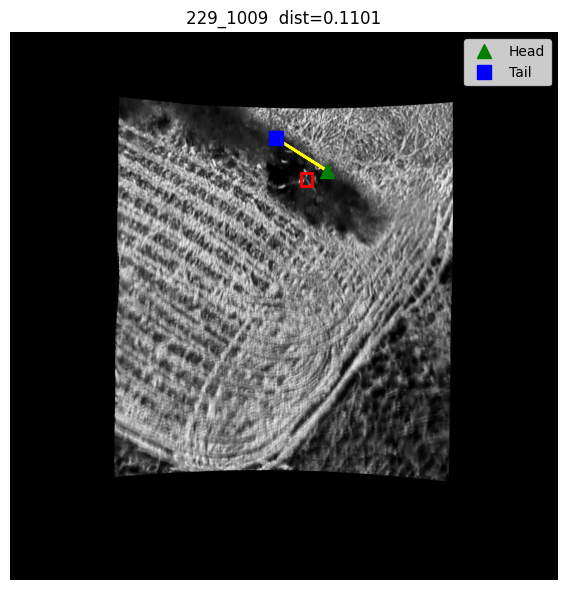
   
```txt
=== Smallest separations (worst labels) ===
```
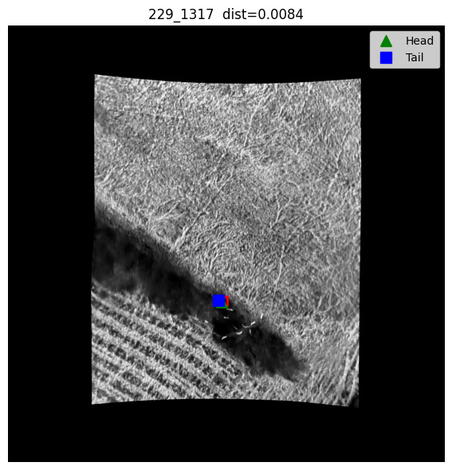

### Explanation
The largest seperations show wrongly matched key points. Whereas the smallest separations show correct keypoint pairs. Naming the largest separation as best labels and the smallest as worst, was based on larger distances being easier to train.

---

## Check json annotations
### Motivation
Check if annotations and IDs match for a file with multiple animals.

### Implementation
```python
with open(GT_EXPORT) as f:
    data = json.load(f)

# Find an image we know has issues
target = '229_1331'
for item in data:
    file_upload = item.get('data', {}).get('img', '')
    raw_stem = Path(file_upload).stem
    img_name = raw_stem.split('-', 1)[-1] if '-' in raw_stem else raw_stem

    if img_name != target:
        continue

    print(f"Image: {img_name}")
    for ann in item.get('annotations', []):
        results = ann.get('result', [])
        print(f"  Annotation has {len(results)} keypoints:")
        for r in results:
            label = r['value']['keypointlabels'][0]
            x = r['value']['x'] / 100.0
            y = r['value']['y'] / 100.0
            print(f"    {label}: ({x:.4f}, {y:.4f})")
```
**Output:**
```txt
Image: 229_1331
  Annotation has 18 keypoints:
    Head: (0.4905, 0.7391)
    Tail: (0.5031, 0.7320)
    Head: (0.5237, 0.7252)
    Tail: (0.5367, 0.7217)
    Head: (0.5576, 0.7297)
    Tail: (0.5528, 0.7152)
    Head: (0.5570, 0.7049)
    Tail: (0.5651, 0.7007)
    Head: (0.5796, 0.6897)
    Tail: (0.5831, 0.6778)
    Tail: (0.5134, 0.6723)
    Head: (0.5018, 0.6703)
    Head: (0.5163, 0.7087)
    Tail: (0.5247, 0.7178)
    Head: (0.4860, 0.6519)
    Head: (0.4879, 0.6526)
    Tail: (0.4934, 0.6468)
    Tail: (0.4811, 0.6494)
```

```python
# check if IDs are present
with open(GT_EXPORT) as f:
    data = json.load(f)

target = '229_1331'
for item in data:
    file_upload = item.get('data', {}).get('img', '')
    raw_stem = Path(file_upload).stem
    img_name = raw_stem.split('-', 1)[-1] if '-' in raw_stem else raw_stem
    if img_name != target:
        continue

    for ann in item.get('annotations', []):
        for r in ann.get('result', []):
            print(r)  # print full result object to see all fields
        break
    break
```
**Output:** (only a part of it)
```txt
{'original_width': 2048, 'original_height': 2048, 'image_rotation': 0, 'value': {'x': 49.05058696993076, 'y': 73.90798331196477, 'width': 0.3115264797507788, 'keypointlabels': ['Head']}, 'id': 'ICBCL0qyrQ', 'from_name': 'kp-1', 'to_name': 'img-1', 'type': 'keypointlabels', 'origin': 'manual'}
{'original_width': 2048, 'original_height': 2048, 'image_rotation': 0, 'value': {'x': 50.30913404629948, 'y': 73.1980336791414, 'width': 0.3115264797507788, 'keypointlabels': ['Tail']}, 'id': 'JFVAguWIjb', 'from_name': 'kp-1', 'to_name': 'img-1', 'type': 'keypointlabels', 'origin': 'manual'}
```
### Explanation
The labels and IDs match even for seeminly difficult files with many animals.


---
## YOLO Keypoint Export

### Implementation

The final labels are written using the YOLO keypoint format:

```text
class_id
x_center
y_center
width
height
head_x
head_y
head_visible
tail_x
tail_y
tail_visible
```

Example:

```text
0 0.50 0.42 0.12 0.10 0.47 0.41 1 0.55 0.43 1
```

### Purpose

This format allows modern YOLO keypoint models to learn:

* Head location
* Tail location
* Animal orientation

directly from thermal imagery.

---

# Final Dataset

## Output Structure

```text
labels_keypoints/
│
├── train/
├── val/
└── test/
```

Each annotation contains:

* Bounding box coordinates
* Head keypoint
* Tail keypoint
* Visibility flags

and is fully compatible with YOLO keypoint training pipelines.

---
# **Start here again**

# Notebook 03 – Model Training

## Objective

This notebook trains a deep learning model to predict head and tail positions for individual animals, enabling orientation estimation from thermal drone imagery.

Two distinct approaches were developed and evaluated.

---

## Approach A – Keypoint Coordinate Regression

### Overview

Approach A treats orientation estimation as a direct coordinate regression problem. The model learns to predict the absolute normalized positions of the head and tail keypoints within each animal crop.

---

### Label Distance Diagnostic

### Motivation

Before training, it is important to verify that the generated keypoint labels contain meaningful spatial separation between head and tail points. Labels where the head and tail are nearly coincident are unreliable and can impair training.

### Implementation

```python
distances = []
for label_file in TRAIN_LABELS.glob('*.txt'):
    with open(label_file) as f:
        for line in f:
            parts = line.strip().split()
            if len(parts) >= 11:
                head = np.array([float(parts[5]), float(parts[6])])
                tail = np.array([float(parts[8]), float(parts[9])])
                distances.append(np.linalg.norm(head - tail))
```
**Output:**
´´´txt
Total training animals:  247
Mean head-tail dist:     0.0193
Median head-tail dist:   0.0174
% with dist < 0.05:      99.2%
% with dist < 0.02:      72.9%
´´´

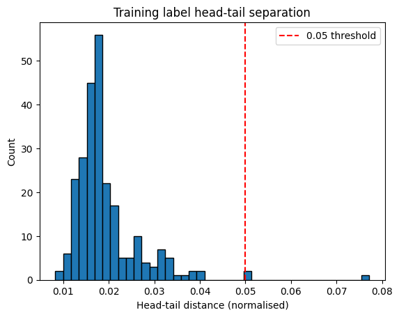

### Explanation

The Euclidean distance between each head-tail pair is computed in normalized image coordinates.

Summary statistics including the mean, median, and the proportion of annotations below separation thresholds of 0.05 and 0.02 are printed, and the full distribution is visualized as a histogram with a reference line marking the 0.05 threshold.

### Purpose

This diagnostic reveals:

* Whether annotations are spatially informative
* The proportion of near-coincident keypoint pairs that may introduce noise
* Potential data quality issues before training begins

---

### Dataset

### Motivation

Each training sample corresponds to a single animal rather than a full image. This requires cropping each animal from its containing image and remapping keypoint coordinates into the crop coordinate system.

### Implementation

```python
class KeypointDataset(Dataset):
    def __init__(self, img_dir, label_dir, transform=None):
        ...
        for label_file in sorted(self.label_dir.glob('*.txt')):
            with open(label_file) as f:
                for i, line in enumerate(f):
                    parts = line.strip().split()
                    if len(parts) >= 11:
                        self.samples.append((img_file, label_file, i))
```

### Explanation

Each sample is stored as a triple of image path, label file path, and line index within the label file. During loading, the bounding box is expanded by a padding factor of 0.5 times the box dimensions on each side, with a minimum crop size of 10% of the image dimension enforced to prevent degenerate crops on very small animals.

Keypoint coordinates are then remapped from full image space into the crop coordinate system:

```python
head_x = max(0.0, min(1.0, (float(parts[5]) * orig_w - x1) / crop_w))
head_y = max(0.0, min(1.0, (float(parts[6]) * orig_h - y1) / crop_h))
```

### Purpose

Cropping around individual animals focuses the model's attention on the relevant region and standardizes the input scale, which is particularly important given the large variation in animal sizes across the dataset.

---

### Data Augmentation

### Motivation

The limited size of the annotated dataset makes augmentation essential to prevent overfitting.

### Implementation

```python
class KeypointDatasetWithFlip(KeypointDataset):
    def __getitem__(self, idx):
        img, keypoints = super().__getitem__(idx)
        if torch.rand(1) < 0.5:
            img = transforms.functional.hflip(img)
            keypoints[0] = 1 - keypoints[0]  # head_x
            keypoints[2] = 1 - keypoints[2]  # tail_x
        if torch.rand(1) < 0.5:
            img = transforms.functional.vflip(img)
            keypoints[1] = 1 - keypoints[1]  # head_y
            keypoints[3] = 1 - keypoints[3]  # tail_y
        return img, keypoints
```

The full training transform pipeline also applies:

```python
# Data augmentation for limited real data
train_transform = transforms.Compose([
    transforms.Resize((IMG_SIZE, IMG_SIZE)),
    transforms.ColorJitter(brightness=0.3, contrast=0.3, saturation=0.2),
    transforms.ToTensor(),
    transforms.Normalize(mean=[0.485, 0.456, 0.406],
                         std=[0.229, 0.224, 0.225])
])

val_transform = transforms.Compose([
    transforms.Resize((IMG_SIZE, IMG_SIZE)),
    transforms.ToTensor(),
    transforms.Normalize(mean=[0.485, 0.456, 0.406],
                        std=[0.229, 0.224, 0.225])
])
```

### Explanation

Horizontal and vertical flipping are applied with 50% probability each. Keypoint coordinates are updated consistently with the image transformation to preserve label correctness. Colour jitter further increases variability in the thermal imagery appearance, and ImageNet normalization prepares the input for the pretrained backbone.

### Purpose

Geometric augmentation doubles the effective dataset size while teaching the model to be invariant to image orientation, which is appropriate because the drone camera can capture animals from any viewing angle.

---

### Model Architecture

### Motivation

A compact pretrained backbone provides a strong initialization while keeping the model computationally efficient for inference on aerial imagery.

### Implementation

```python
class KeypointModel(nn.Module):
    def __init__(self, num_keypoints=2):
        super().__init__()
        self.backbone = models.mobilenet_v3_small(weights='IMAGENET1K_V1')
        self.backbone.classifier = nn.Sequential(
            nn.Linear(576, 128),
            nn.ReLU(),
            nn.Dropout(0.5),
            nn.Linear(128, num_keypoints * 2)
        )

    def forward(self, x):
        return torch.sigmoid(self.backbone(x))
```

### Explanation

MobileNetV3-Small is used as the feature extraction backbone, initialized with ImageNet weights. The original classification head is replaced with a lightweight regression head that outputs four values corresponding to the normalized x and y coordinates of the head and tail keypoints. A sigmoid activation constrains all outputs to the range [0, 1], consistent with the normalized coordinate representation.

The model contains approximately 1.5 million parameters, making it suitable for deployment on resource-constrained hardware. (The notebooks were run on Azure, but we still tried to make it suitable for our local machines.)

---

### Loss Function

### Motivation

A loss function combining coordinate accuracy, orientation alignment, and keypoint separation is required to train the model effectively on all aspects of the orientation estimation task.

### Implementation

```python
def keypoint_loss(outputs, targets):
    coord_loss = nn.functional.mse_loss(outputs, targets)

    pred_vec = outputs[:, :2] - outputs[:, 2:]
    true_vec = targets[:, :2] - targets[:, 2:]

    pred_norm = torch.norm(pred_vec, dim=1, keepdim=True).clamp(min=1e-6)
    true_norm = torch.norm(true_vec, dim=1, keepdim=True).clamp(min=1e-6)
    cos_sim   = (pred_vec / pred_norm * true_vec / true_norm).sum(dim=1)
    orient_loss = (1 - cos_sim).mean()

    pred_dist = torch.norm(pred_vec, dim=1)
    true_dist = torch.norm(true_vec, dim=1)
    sep_loss  = nn.functional.mse_loss(pred_dist, true_dist)

    return coord_loss + 0.1 * orient_loss + 0.1 * sep_loss
```

### Explanation

The composite loss consists of three terms:

* `coord_loss`: mean squared error between predicted and target keypoint coordinates
* `orient_loss`: measures the cosine dissimilarity between the predicted and target head-to-tail direction vectors. Vector norms are clamped to a minimum of 1e-6 to prevent numerical instability when head and tail are nearly coincident
* `sep_loss`: penalizes errors in the predicted distance between head and tail, encouraging the model to preserve the correct scale of separation

The orientation and separation terms are each weighted at 0.1 to balance their contribution relative to the coordinate loss.

---

### Training Procedure

### Motivation

Training the regression head before exposing the backbone to gradient updates stabilizes early learning and prevents the pretrained feature representations from being disrupted by an initially random head.

### Implementation

```python
for param in model.backbone.parameters():
    param.requires_grad = False
# Keep the new head trainable
for param in model.backbone.classifier.parameters():
    param.requires_grad = True

for epoch in range(NUM_EPOCHS):

    # unfreeze backbone after warmup and lower LR
    if epoch == WARMUP_EPOCHS:
        print(f"\nEpoch {epoch+1}: Unfreezing backbone with lower LR...")
        for param in model.backbone.parameters():
            param.requires_grad = True
        for g in optimizer.param_groups:
            g['lr'] = LEARNING_RATE * 0.1
```

An Adam optimizer with learning rate 1e-4 is used throughout, together with a ReduceLROnPlateau scheduler that halves the rate after 10 epochs without improvement. Gradient clipping with a maximum norm of 1.0 is applied at each step.

### Explanation

The first two warmup epochs train only the regression head with the backbone frozen. After warmup the backbone is unfrozen and fine-tuned at one tenth of the initial learning rate. This two-phase strategy is a standard transfer learning practice that prevents catastrophic forgetting of the pretrained representations.

The best-performing model on the validation set is saved throughout training.

---

## Approach B – Angle Regression

### Overview

Approach B reformulates orientation estimation as a direct angle regression problem. Instead of predicting the absolute positions of individual keypoints, the model predicts the head-to-tail orientation as a unit vector encoded in sine and cosine form.

---

### Target Encoding

### Motivation

Predicting a raw angle in degrees or radians is problematic because angular quantities wrap around at 360°. The discontinuity at the wrap point causes large gradient errors for predictions that are close in angle but numerically far apart in the scalar representation.

### Implementation

```python
dx = hx - tx
dy = hy - ty
angle = np.arctan2(dy, dx)

angle_target = torch.tensor(
    [np.sin(angle), np.cos(angle)],
    dtype=torch.float32
)
```

### Explanation

The head-to-tail vector is computed in pixel coordinates and its angle is extracted using `arctan2`. The angle is then encoded as a two-dimensional unit vector `(sin θ, cos θ)`. This representation is continuous across the full angular range, with no discontinuities, and allows the network output to be evaluated using the cosine similarity loss.

---

### Model Architecture

### Motivation

Approach B modifies the output layer to produce a two-dimensional unit vector instead of four coordinate values.

### Implementation

```python
class KeypointModel(nn.Module):
    def __init__(self):
        super().__init__()
        self.backbone = models.mobilenet_v3_small(weights='IMAGENET1K_V1')
        self.backbone.classifier = nn.Sequential(
            nn.Linear(576, 128),
            nn.ReLU(),
            nn.Dropout(0.3),
            nn.Linear(128, 2)  # sin and cos of angle
        )

    def forward(self, x):
        out = self.backbone(x)
        # Normalise to unit vector so output is always a valid angle
        return nn.functional.normalize(out, dim=1)
```

### Explanation

The same MobileNetV3-Small backbone is used, but the regression head now outputs two values. The forward pass applies L2 normalization to the output vector, ensuring that the prediction always lies on the unit circle. This geometric constraint simplifies the loss formulation and makes the output directly interpretable as an orientation angle.

---

### Loss Function

### Motivation

Because the target representation is a unit vector, the natural loss is one minus the cosine similarity between the predicted and target vectors.

### Implementation

```python
def angle_loss(outputs, targets):
    cos_sim = (outputs * targets).sum(dim=1)
    return (1 - cos_sim).mean()
```

### Explanation

When prediction and target are perfectly aligned, the cosine similarity equals 1 and the loss is 0. When they point in opposite directions, the loss reaches its maximum of 2. This formulation is scale-invariant and handles the full 360° range without discontinuity, making it well-suited for orientation estimation.

Note that the 180° ambiguity inherent in head-tail orientation is handled during evaluation by folding the angular error into the range [0°, 90°].

---

### Augmentation

### Motivation

Approach B applies stronger augmentation than Approach A to compensate for the reduced information in the angle-only target.

### Implementation

```python
train_transform = transforms.Compose([
    transforms.Resize((IMG_SIZE, IMG_SIZE)),
    transforms.ColorJitter(brightness=0.4, contrast=0.4, saturation=0.3),
    transforms.GaussianBlur(kernel_size=3, sigma=(0.1, 2.0)),
    transforms.ToTensor(),
    transforms.Normalize(mean=[0.485, 0.456, 0.406],
                         std=[0.229, 0.224, 0.225])
])

val_transform = transforms.Compose([
    transforms.Resize((IMG_SIZE, IMG_SIZE)),
    transforms.ToTensor(),
    transforms.Normalize(mean=[0.485, 0.456, 0.406],
                         std=[0.229, 0.224, 0.225])
])
```

### Explanation

In addition to colour jitter with slightly increased intensities, a Gaussian blur with a randomly sampled standard deviation is applied. This simulates focus variation in the thermal imagery and encourages the model to rely on structural shape features rather than high-frequency texture detail.

---

### Training Evaluation

### Motivation

Unlike coordinate regression, where loss values correspond directly to pixel distances, the angle loss is dimensionless. An additional metric tracking angular error in degrees is therefore computed during training.

### Implementation

```python
def evaluate_angle(model, loader, device):
    model.eval()
    errors_deg = []
    with torch.no_grad():
        for imgs, targets in loader:
            imgs    = imgs.to(device)
            targets = targets.to(device)
            preds   = model(imgs)
            pred_angles = torch.atan2(preds[:,0],  preds[:,1])
            true_angles = torch.atan2(targets[:,0], targets[:,1])
            diff = (pred_angles - true_angles).abs()
            diff = torch.min(diff, 2 * np.pi - diff)
            diff = torch.min(diff, np.pi - diff)
            errors_deg.extend((diff * 180 / np.pi).cpu().numpy())
    errors_deg = np.array(errors_deg)
```

### Explanation

The predicted and ground-truth angles are recovered from the sine-cosine representations using `arctan2`. The absolute angular difference is folded twice: first into the range [0°, 180°] to account for the circular nature of angles, and then into [0°, 90°] to account for the head-tail ambiguity. Summary statistics including mean error, median error, and the proportion of predictions within 30°, 45°, and 90° thresholds are reported.

---

# Notebook 04 – Evaluation

## Objective

This notebook evaluates the trained keypoint detection model on the test set and on real ground-truth annotations exported from Label Studio.

---

## Ground Truth Loading

### Motivation

Evaluation must be performed against the original human-annotated keypoints rather than the derived YOLO labels, in order to measure true prediction quality independent of any pairing assumptions made during data preparation.

### Implementation

```python
HEAD_LABEL = 'Head'
TAIL_LABEL = 'Tail'

def load_ground_truth(gt_export_path):
    if not gt_export_path.exists():
        print(f"ERROR: GT file not found: {gt_export_path}")
        return {}

    with open(gt_export_path) as f:
        data = json.load(f)

    gt = {}
    for item in data:
        img_name = Path(item.get('data', {}).get('img', item.get('file_upload', ''))).stem.split('-', 1)[-1]

        pairs = []
        for ann in item['annotations']:
            pending_head = None
            all_tails = [
                (r['value']['x'] / 100.0, r['value']['y'] / 100.0)
                for r in ann['result']
                if r['value']['keypointlabels'][0] == 'Tail'
            ]

            for r in ann['result']:
                label = r['value']['keypointlabels'][0]
                x = r['value']['x'] / 100.0
                y = r['value']['y'] / 100.0

                if label == 'Head':
                    pending_head = (x, y)
                elif label == 'Tail' and pending_head is not None:
                    pairs.append({'Head': pending_head, 'Tail': (x, y)})
                    pending_head = None

            # If a head had no following tail, pair by nearest remaining tail
            if pending_head is not None:
                used_tails = {p['Tail'] for p in pairs}
                remaining = [t for t in all_tails if t not in used_tails]
                if remaining:
                    best = min(remaining,
                               key=lambda t: (pending_head[0]-t[0])**2 + (pending_head[1]-t[1])**2)
                    pairs.append({'Head': pending_head, 'Tail': best})

        if pairs:
            gt[img_name] = pairs
```

### Explanation

Annotations are loaded from the merged Label Studio export. Head-tail pairs are reconstructed using annotation order as the primary strategy, with a nearest-neighbour fallback for any head annotation that has no immediately following tail. Image names are extracted by stripping the upload prefix that Label Studio prepends.

### Purpose

This function provides a clean ground-truth dictionary mapping image names to lists of head-tail coordinate pairs, which serves as the reference for all evaluation metrics.

---

## Prediction-to-Ground-Truth Matching

### Motivation

In scenes containing multiple animals, model predictions must be matched to ground-truth annotations before errors can be computed. A greedy strategy based on spatial proximity is used.

### Implementation

```python
def match_predictions_to_gt(predictions, gt_pairs):
    matched = []
    used_gt = set()
    for pred in predictions:
        pred_mid = np.array([
            (pred['pred_head'][0] + pred['pred_tail'][0]) / 2,
            (pred['pred_head'][1] + pred['pred_tail'][1]) / 2,
        ])
        best_dist, best_idx = float('inf'), None
        for i, gt_pair in enumerate(gt_pairs):
            if i in used_gt:
                continue
            gt_mid = np.array([
                (gt_pair['Head'][0] + gt_pair['Tail'][0]) / 2,
                (gt_pair['Head'][1] + gt_pair['Tail'][1]) / 2,
            ])
            d = np.linalg.norm(pred_mid - gt_mid)
            if d < best_dist:
                best_dist, best_idx = d, i
        if best_idx is not None:
            matched.append((pred, gt_pairs[best_idx]))
            used_gt.add(best_idx)
        else:
            matched.append((pred, None))
    return matched
```

### Explanation

Each predicted animal is matched to the ground-truth annotation whose midpoint lies closest to the predicted midpoint. Midpoints are computed as the average of the head and tail positions, providing a stable reference point for matching that is robust to individual keypoint errors. Each ground-truth annotation can be matched at most once.

---

## Evaluation on Ground Truth

### Approach A - Keypoint Error

### Motivation

For Approach A, the primary metrics are the mean errors of the predicted head and tail positions relative to the ground-truth annotations. A symmetry correction handles the inherent head-tail ambiguity.

### Implementation

```python
def evaluate_on_real_gt(model, gt, device, img_size=IMG_SIZE):
    model.eval()
    .
    .
    .
    head_err_normal  = np.linalg.norm(pred_head_crop - true_head_crop)
    tail_err_normal  = np.linalg.norm(pred_tail_crop - true_tail_crop)
    head_err_flipped = np.linalg.norm(pred_head_crop - true_tail_crop)
    tail_err_flipped = np.linalg.norm(pred_tail_crop - true_head_crop)

if (head_err_flipped + tail_err_flipped) < (head_err_normal + tail_err_normal):
    head_error, tail_error = head_err_flipped, tail_err_flipped
else:
    head_error, tail_error = head_err_normal, tail_err_normal
```

### Explanation

For each matched pair, both the normal assignment and the flipped assignment (where the predicted head is compared to the ground-truth tail and vice versa) are evaluated. The assignment with lower total error is selected. This corrects for cases where the model correctly identifies the orientation axis but assigns the head and tail labels in reverse.

---

### Approach B – Angular Error

### Motivation

For Approach B, the evaluation metric is the angular error in degrees between the predicted and ground-truth orientation vectors.

### Implementation

```python
def evaluate_on_real_gt(model, gt, device, img_size=IMG_SIZE):
    model.eval()
    .
    .
    .
    pred_angle = np.arctan2(sin_cos[0], sin_cos[1])
    gt_angle   = np.arctan2(hy - ty, hx - tx)

    diff = abs(pred_angle - gt_angle)
    diff = min(diff, 2 * np.pi - diff)
    diff = min(diff, np.pi - diff)
    err_deg = np.degrees(diff)
```

### Explanation

The predicted orientation is recovered from the sine-cosine output, and the ground-truth orientation is computed directly from the annotated head and tail pixel coordinates. The angular difference is folded into [0°, 90°] to account for both the circular wrap of angles and the head-tail ambiguity, ensuring that a prediction that correctly identifies the orientation axis but disagrees on which end is the head is not penalized as a 180° error.

### Reported Metrics

The following summary statistics are reported for both approaches:

* total number of animals evaluated
* mean and median error
* proportion of predictions within 30°, 45°, and 90° of the ground truth

---

## Error Distribution Visualization

### Motivation

Summary statistics alone do not reveal whether errors are uniformly distributed or concentrated in specific failure cases.

### Implementation

```python
if errors:
    plt.figure(figsize=(10, 5))
    plt.hist(errors, bins=20, alpha=0.7, color='steelblue', edgecolor='black')
    plt.xlabel('Angular Error (degrees)')
    plt.ylabel('Count')
    plt.title(f'Orientation Error Distribution on Real GT ({len(errors)} animals)')
    plt.axvline(x=30, color='red',    linestyle='--', linewidth=2, label='30° threshold')
    plt.axvline(x=45, color='orange', linestyle='--', linewidth=2, label='45° threshold')
    plt.axvline(x=90, color='gray',   linestyle='--', linewidth=2, label='90° threshold')
    plt.legend()
    plt.grid(True, alpha=0.3)
    plt.tight_layout()
    plt.show()
```

**Outputs:**
*Approach A:*
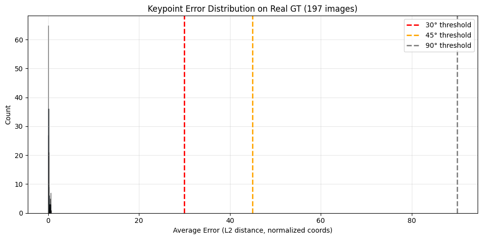
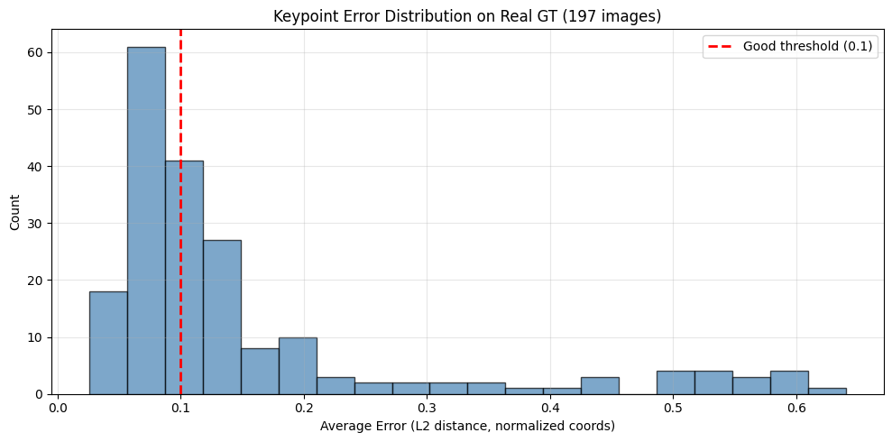
*Approach B:*
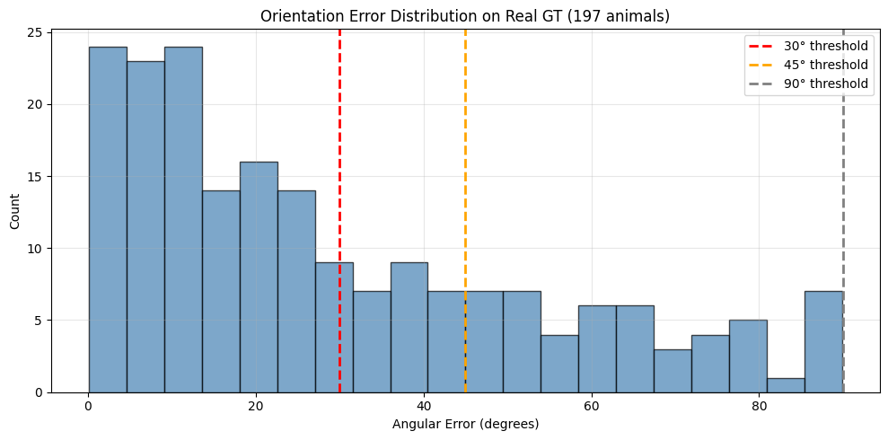

### Explanation

A histogram of angular errors is plotted with reference lines at 30°, 45°, and 90°. This visualization makes the shape of the error distribution immediately interpretable and highlights whether the model produces a long tail of large failures or achieves broadly consistent accuracy.

---

# Notebook 05 – Visualization

## Objective

This notebook visualizes model predictions overlaid on original thermal images, providing qualitative insight into prediction quality and failure modes across the test set.

---

## Visualization Function

### Motivation

Quantitative metrics do not fully capture whether a model is useful in practice. Visual inspection of individual predictions reveals spatial alignment, systematic biases, and common failure patterns that aggregate statistics may obscure.

### Implementation

```python
def visualize_prediction(image_name, img_split='test', show_ground_truth=True):
    img_path = DATA_DIR / 'images' / img_split / f"{image_name}.jpg"
    if not img_path.exists():
        print(f"Image not found: {img_path}")
        return None

    kp_label_path = None
    for split in ['test', 'val', 'train']:
        candidate = LABELS_DIR / split / f"{image_name}.txt"
        if candidate.exists():
            kp_label_path = candidate
            break
    if kp_label_path is None:
        print(f"No label found for {image_name}, skipping")
        return None

    img = Image.open(img_path).convert('RGB')
    orig_w, orig_h = img.size

    transform = transforms.Compose([
        transforms.Resize((IMG_SIZE, IMG_SIZE)),
        transforms.ToTensor(),
        transforms.Normalize(mean=[0.485, 0.456, 0.406],
                             std=[0.229, 0.224, 0.225])
    ])

    bboxes = load_all_bboxes(kp_label_path)
    if not bboxes:
        print(f"No bboxes found for {image_name}")
        return None

    # Run model on every bbox — get angle per animal
    predictions = []
    for bbox in bboxes:
        x1, y1, x2, y2 = compute_crop(bbox, orig_w, orig_h)
        cx_px = bbox['cx'] * orig_w
        cy_px = bbox['cy'] * orig_h
        img_crop = img.crop((x1, y1, x2, y2))
        img_tensor = transform(img_crop).unsqueeze(0).to(DEVICE)
        with torch.no_grad():
            out = model(img_tensor).cpu().numpy()[0]
        angle = np.arctan2(out[0], out[1])
        arrow_len = max(bbox['bw'] * orig_w, bbox['bh'] * orig_h) * 1.5
        predictions.append({
            'cx': cx_px,
            'cy': cy_px,
            'angle': angle,
            'arrow_len': arrow_len,
        })

    fig, ax = plt.subplots(1, 1, figsize=(10, 10))
    ax.imshow(img)

    # Draw all bboxes
    for bbox in bboxes:
        cx, cy = bbox['cx'] * orig_w, bbox['cy'] * orig_h
        bw, bh = bbox['bw'] * orig_w, bbox['bh'] * orig_h
        rect = plt.Rectangle((cx - bw/2, cy - bh/2), bw, bh,
                              fill=False, edgecolor='red', linewidth=1.5)
        ax.add_patch(rect)

    # Draw GT arrows
    if show_ground_truth and image_name in gt_lookup:
        for i, pair in enumerate(gt_lookup[image_name]):
            gt_hx = pair['Head'][0] * orig_w
            gt_hy = pair['Head'][1] * orig_h
            gt_tx = pair['Tail'][0] * orig_w
            gt_ty = pair['Tail'][1] * orig_h
            label = 'GT orientation' if i == 0 else '_nolegend_'
            ax.annotate('', xy=(gt_hx, gt_hy), xytext=(gt_tx, gt_ty),
                        arrowprops=dict(arrowstyle='->', color='white', lw=1.5,
                                        mutation_scale=10),
                        label=label)
            ax.plot(gt_hx, gt_hy, 'r^', markersize=4, alpha=0.9,
                    label='GT Head' if i == 0 else '_nolegend_')
            ax.plot(gt_tx, gt_ty, 'rs', markersize=4, alpha=0.9,
                    label='GT Tail' if i == 0 else '_nolegend_')

    # Draw predicted orientation arrows from bbox center
    for i, pred in enumerate(predictions):
        dx = np.cos(pred['angle']) * pred['arrow_len']
        dy = np.sin(pred['angle']) * pred['arrow_len']
        label = 'Pred orientation' if i == 0 else '_nolegend_'
        ax.annotate('', xy=(pred['cx'] + dx, pred['cy'] + dy),
                    xytext=(pred['cx'] - dx, pred['cy'] - dy),
                    arrowprops=dict(arrowstyle='->', color='yellow', lw=2,
                                    mutation_scale=12))
        if i == 0:
            ax.plot([], [], color='yellow', label='Pred orientation')

    n_gt = len(gt_lookup.get(image_name, []))
    ax.legend(loc='upper right', fontsize=9)
    ax.axis('off')
    plt.title(f"{image_name}  |  {len(bboxes)} bbox(es)  |  {n_gt} GT pair(s)", fontsize=12)
    plt.tight_layout()
    plt.show()

    return predictions
```

**Output:**
*Approach A:*
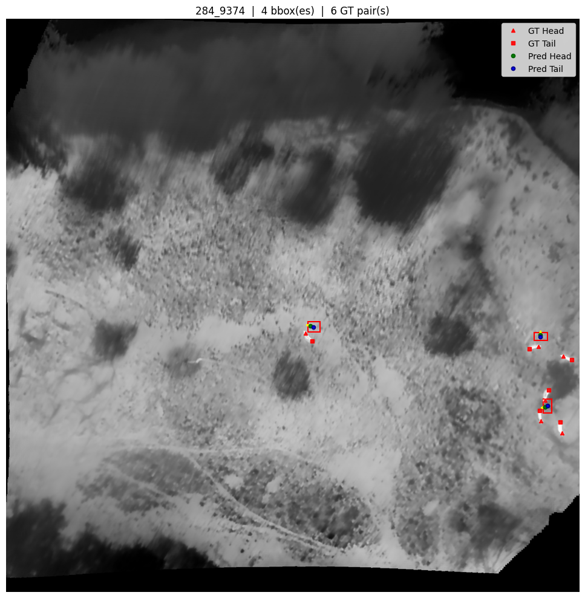

*Approach B:*
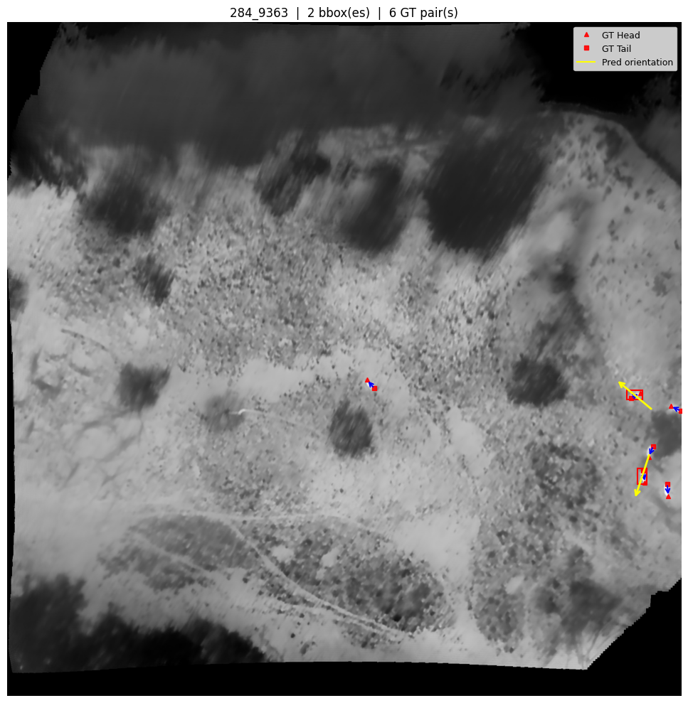


### Explanation

For each image, the function:

1. Loads the original thermal image and its bounding box annotations.
2. Runs the model on a crop extracted around each annotated bounding box.
3. Draws all bounding boxes as red rectangles.
4. Overlays ground-truth keypoints as triangles (head) and squares (tail) with white orientation arrows.
5. *Approach A:* Overlays predicted keypoints as green (head) and blue (tail) circles with yellow orientation arrows pointing from tail to head.
5. *Apprach B:* Uses only the yellow orientation arrow pointing from tail to head.

The number of bounding boxes and ground-truth pairs is displayed in the plot title, facilitating identification of images where the counts differ due to unannotated animals or missed detections.

---

## Batch Visualization

### Motivation

Inspecting individual images is time-consuming. A batch view allows rapid assessment of prediction quality across many samples simultaneously.

### Implementation

```python
def visualize_batch(n_samples=8):
    cols = 4
    rows = (len(batch_images) + cols - 1) // cols
    fig, axes = plt.subplots(rows, cols, figsize=(5 * cols, 5 * rows))

    for idx, (img_name, label_split) in enumerate(batch_images):
        ...
        for pred in predictions:
            axes[idx].arrow(
                pred['pred_tail'][0], pred['pred_tail'][1],
                pred['pred_head'][0] - pred['pred_tail'][0],
                pred['pred_head'][1] - pred['pred_tail'][1],
                head_width=5, head_length=15, fc='yellow', ec='yellow'
            )
```

**Output:**
*Approach A:*
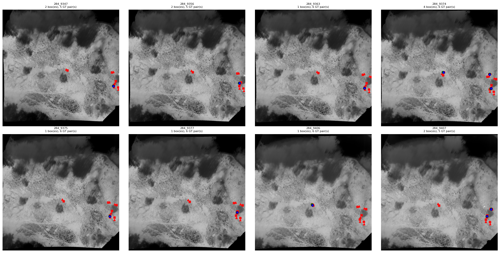

*Approach B:*
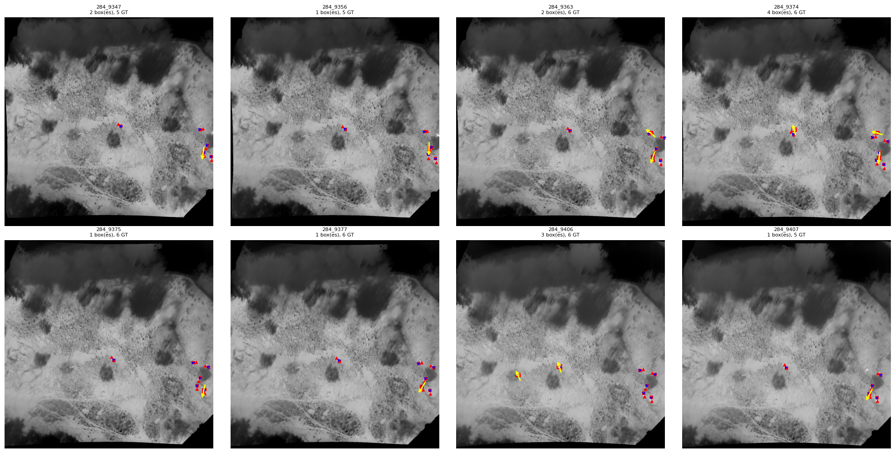

### Explanation

Up to eight test images are arranged in a 4-column grid. For each image, bounding boxes, predicted keypoints, and/or orientation arrows are drawn using the same visual conventions as the individual visualization function. The compact layout enables rapid identification of systematic failure patterns such as consistent head-tail swaps or poor performance on specific animal sizes or thermal signatures.

---

# Discussion and Limitations

## Annotation Ordering Assumption

The pairing algorithm assumes that annotators followed the sequence:

```text
Head → Tail → Head → Tail
```

Although manual verification confirms that this assumption generally holds, annotation inconsistencies may still introduce pairing errors.

---

## Comparison of Approaches

Approach A and Approach B represent fundamentally different problem formulations with distinct trade-offs.

**Approach A predicts** absolute keypoint coordinates and therefore provides richer geometric information, including head and tail positions that can be used directly for downstream tasks such as trajectory analysis or counting. However, it is sensitive to label quality: near-coincident head-tail pairs produce weak orientation signals and noisy gradients.

**Approach B** discards absolute position information and predicts only the orientation angle. The cosine loss is geometrically principled and handles the circular nature of angles naturally. The 180° head-tail ambiguity is addressed at evaluation time by folding the angular error. Approach B requires fewer assumptions about keypoint separation and may generalize better when annotation quality is variable, but it cannot recover keypoint locations for downstream use without additional information.

---

## Small Object Challenges

Many animals occupy only a small portion of the image.

Consequently:

* head and tail points may be separated by only a few pixels
* orientation estimation becomes more difficult
* annotation uncertainty increases

The minimum crop size enforced during dataset loading mitigates the most extreme cases, but small animals remain the primary source of prediction errors for both approaches.

---

## Thermal Imaging Constraints

Unlike RGB imagery, thermal images contain limited texture information.

Therefore, orientation estimation relies heavily on:

* object shape
* heat distribution
* keypoint quality

rather than fine-grained visual details.

---

# Conclusion

The full pipeline transforms the BAMBI wildlife dataset from a standard object detection dataset into an orientation-aware keypoint dataset and trains models capable of estimating animal orientation from thermal drone imagery.  
  
The exploration and preparation notebooks validate dataset quality and generate head-tail keypoint annotations. Two training approaches were developed and evaluated: Approach A performs direct coordinate regression, while Approach B reformulates the task as angle regression using a sine-cosine encoding.
  
Our team ultimately favored Approach B, as it produced more consistent and reliable results for the orientation estimation use case. Approach A was ruled out because the head and tail keypoints in the dataset are frequently too close together to provide a dependable directional signal. When keypoint separation is small, the predicted orientation vector is highly sensitive to small localization errors, making the regressed coordinates an unreliable basis for angle estimation. Approach B sidesteps this issue entirely by predicting the orientation angle directly, bypassing the dependency on absolute keypoint positions and the spatial separation between them.
  
The evaluation notebook quantifies this performance difference against human-annotated ground truth using angular error metrics, and the visualization notebook provides qualitative confirmation of prediction quality across the test set.